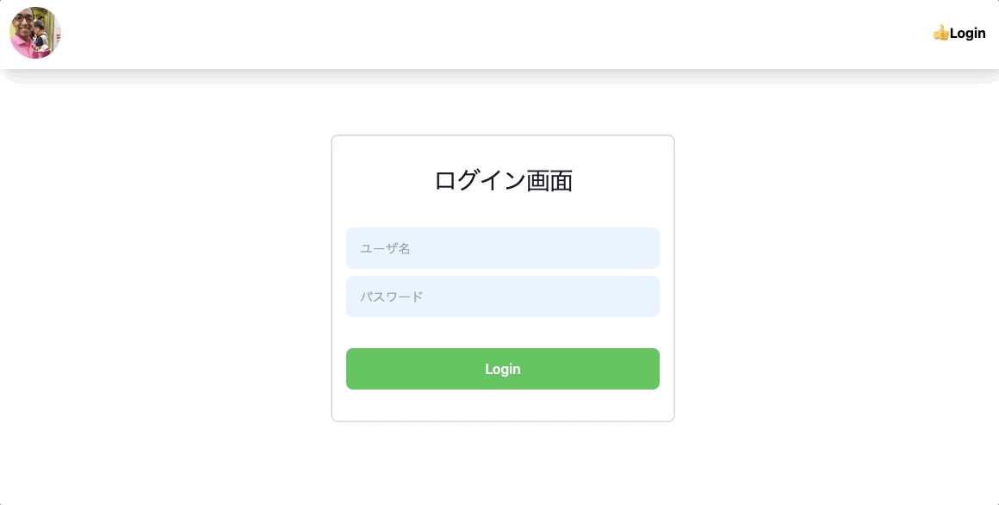

# Tekken Frame Data Admin ver0.1

## なぜ作ってるか

[Tekken Frame Data (NextJs)](https://github.com/PerryM123/tekken-frame-data) は鉄拳 7 のフレーム表にて表示されてますが [Tekken Frame Data Admin (Nuxt3)](https://github.com/PerryM123/tekken-frame-data-admin) はそのフレームデータを管理する CMS 側です。

基本、Tekken Frame Data Admin は SSR 側で [Tekken Frame Data Backend （Express + TypeORM）](https://github.com/PerryM123/tekken-frame-data-backend) のエンドポイントを叩いて鉄拳 7 フレーム情報を取得・追加・削除などをしてます。



## 機能一覧

- SSR 側で[バックエンド](https://github.com/PerryM123/tekken-frame-data-backend)を触れる
- ユーザセッション管理　(Redis)
- Tailwind CSS で見た目を実装

## 目的

Vue3 と Nuxt3 を身につけるように tekken-frame-data （[tekken-frame-data フロントエンド](https://github.com/PerryM123/tekken-frame-data) と [tekken-frame-data バックエンド](https://github.com/PerryM123/tekken-frame-data-backend)） の管理画面を実装しました。

# Getting Started

## Tailwind CSS IntelliSense について

vscode を使ってる人は Tailwind の入力支援が効くように settings.json に以下を追加してくさい。

```
"editor.quickSuggestions": {
  "strings": true
},
"css.validate": false,
"editor.inlineSuggest.enabled": true
```

## Installing Node Version Manager (nvm)

Source: https://github.com/nvm-sh/nvm#installing-and-updating

### 1. nvm インストール

`$ curl -o- https://raw.githubusercontent.com/nvm-sh/nvm/v0.39.4/install.sh | bash` で nvm をインストール

### 2. .bashrc に以下のコードを追加

```
cdnvm() {
    command cd "$@" || return $?
    nvm_path=$(nvm_find_up .nvmrc | tr -d '\n')

    # If there are no .nvmrc file, use the default nvm version
    if [[ ! $nvm_path = *[^[:space:]]* ]]; then

        declare default_version;
        default_version=$(nvm version default);

        # If there is no default version, set it to `node`
        # This will use the latest version on your machine
        if [[ $default_version == "N/A" ]]; then
            nvm alias default node;
            default_version=$(nvm version default);
        fi

        # If the current version is not the default version, set it to use the default version
        if [[ $(nvm current) != "$default_version" ]]; then
            nvm use default;
        fi

    elif [[ -s $nvm_path/.nvmrc && -r $nvm_path/.nvmrc ]]; then
        declare nvm_version
        nvm_version=$(<"$nvm_path"/.nvmrc)

        declare locally_resolved_nvm_version
        # `nvm ls` will check all locally-available versions
        # If there are multiple matching versions, take the latest one
        # Remove the `->` and `*` characters and spaces
        # `locally_resolved_nvm_version` will be `N/A` if no local versions are found
        locally_resolved_nvm_version=$(nvm ls --no-colors "$nvm_version" | tail -1 | tr -d '\->*' | tr -d '[:space:]')

        # If it is not already installed, install it
        # `nvm install` will implicitly use the newly-installed version
        if [[ "$locally_resolved_nvm_version" == "N/A" ]]; then
            nvm install "$nvm_version";
        elif [[ $(nvm current) != "$locally_resolved_nvm_version" ]]; then
            nvm use "$nvm_version";
        fi
    fi
}

alias cd='cdnvm'
cdnvm "$PWD" || exit
```

### 3. nvm で node バージョンを導入

```
$ nvm install 18.3.0
```

## Running local

```
$ git clone git@github.com:PerryM123/tekken-frame-data-admin.git
$ cd tekken-frame-data-admin
$ yarn
$ yarn local
```

## Techonogies being used

- Admin 管理ページ側（フロントエンド）: Nuxt3 （[参考](https://github.com/PerryM123/tekken-frame-data-admin)）
- Tekken Frame Data アプリ側（フロントエンド）: NextJS（[参考](https://github.com/PerryM123/tekken-frame-data)）
- サーバーサイド: Express.js （[参考](https://github.com/PerryM123/tekken-frame-data-backend)）
- コンテナ管理: Docker
- データベース: MySQL
